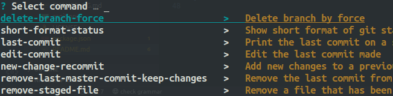

# easy-git - `esgit`

CLI package with simplified aliases for git commands.

## The problem

`git` can be easy to use sometimes, but some other times, it's complex. This requires googling or stackoverflow.

## The solution

`esgit`! `esgit` provides simpler aliases which makes working with git easy. The simplicity is also aided by an interactive autocomplete platfrom by [enquirer](https://www.npmjs.com/package/enquirer) for selection and autocompletion of commands. Added to this is that the real `git` commands are shown right there in the terminal before execution.

**Note that** `esgit`'s command are not executed. These are just aliases that trigger the real git commands.

## Benefits

1. It makes working with git easier, plus, you learn git.
2. **You do not have to switch between esgit and git for different situations**. You're probably thinking, "If I want to use a simple alias provided by this package, I'd use it, but if I want to just clone a repository, I'd use git". But it isn't necessary. When esgit cannot execute a command (which is not provided in [its list](./src/commands.js)), it hands over the commands to git to execute. This way, `esgit` sorts of does all git does.

## Usage

### Installation

It can be installed with `npm` which means you must have [node](https://nodejs.org/en/download/) installed to also install npm.

```shell
npm i -g esgit
```

The `g` flag is important so that the package can be used as a CLI command.

### Examples

You can just enter `esgit` in your terminal to show the list of commands which you can choose from. When you do so, you see the commands displayed like this:

<div style='max-width: 400px; margin: 0 auto'>

</div>

Or you can type the command directly in the terminal if you know them.

1. To change your last commit message

```shell
    esgit edit-commit "new message here"
```

Result:

```shell
git-command: git commit --amend -m "new message here"
#  the result
```

2. Remove last commit from master and keep the changes

```shell
esgit remove-last-master-commit-keep-changes
```

Result:

```shell
git-command: git reset HEAD~ --hard
# the result
```

2. Cloning a git repository isn't hard, but let's assume that `esgit` does not have it in its list:

```shell
esgit clone <url> <folder>
```

Result:

```shell
esgit: 'clone' does not exist
Attempting to do 'git clone <url> <folder>'
# clone status and done!
```

Some of the commands are long, because this package aims for simplicity and easy understanding of action to be executed. Moreover, you can just get all the commands by just entering `esgit` command.

To know what a command does, simply enter the following:

```shell
esgit help
```

It brings a list of commands which you can select from to know the properties.

Find a list of all commands [here](./help/allcommands.txt)

## Issues and Contributions

Your contribution to this project would be highly appreciated. Could be a documentation issue, pull request, feature request, they are all welcome.

-   [Create a pull request](https://github.com/dillionmegida//pulls)
-   [Open an issue](https://github.com/dillionmegida/cross-cmd/issues)

## LICENSE

[MIT](/LICENSE)
